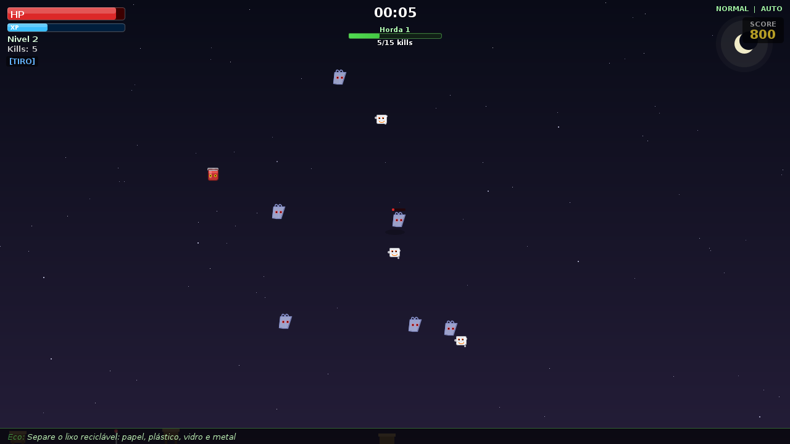
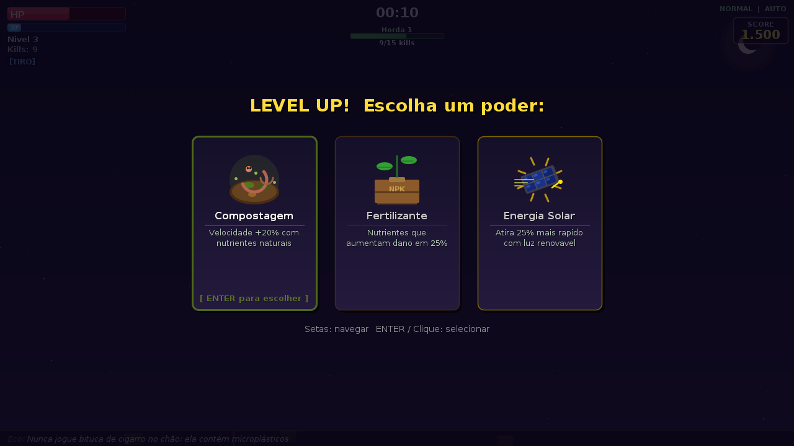
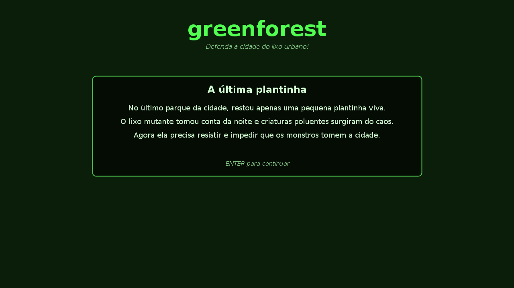

# Green Forest


**No último parque da cidade restou uma única plantinha viva, e o lixo mutante tomou conta da noite.** Green Forest é um jogo de sobrevivência em hordas em que você controla essa plantinha, derrota criaturas feitas de sacolas, latas, pneus e fumaça, e aprende um fato real sobre o resíduo que acabou de vencer.

Jogo feito para a APS da faculdade, em Java puro com Swing, sem bibliotecas externas.

<p align="center">
  
  
</p>
<p align="center">
  
</p>

---

## Como se joga

| Ação | Tecla |
|---|---|
| Mover | `W` `A` `S` `D` ou setas |
| Mirar e atirar (modo manual) | mouse e clique |
| Navegar nos menus | setas `↑` `↓` e `Enter` |
| Escolher um poder no level up | setas `←` `→` e `Enter`, ou clique |
| Pausar (salvar, trocar ataque, voltar ao menu) | `Esc` |
| Depois do game over | `R` jogar de novo · `T` ver placar · `M` menu |

Antes de começar, você escolhe:

- **Dificuldade:** fácil, normal ou difícil. Ela muda a velocidade e o dano dos inimigos, a frequência com que eles surgem, a vida e o dano dos chefes e o intervalo entre um chefe e outro.
- **Tipo de ataque:** *tiro*, com projéteis de longo alcance, ou *área*, um pulso curto ao redor da plantinha.
- **Modo de disparo do tiro:** automático, ou manual com mira no mouse.

## O que tem no jogo

- **10 hordas temáticas**, cada uma ligada a um resíduo, como sacolas plásticas, latas de alumínio, pneus, nuvem tóxica, cigarros, garrafas PET, óleo de cozinha, isopor, agrotóxicos e entulho. Ao começar uma horda, o jogo mostra um fato sobre ela.
- **6 chefes**: Lixo Eletrônico, Fábrica Poluente, Caminhão de Lixo, Derramamento de Petróleo, Motosserra do Desmate e Ilha de Plástico. Depois de cada vitória aparece uma tela com o que você aprendeu.
- **7 poderes ecológicos** para escolher a cada nível:

  | Poder | Efeito |
  |---|---|
  | Fertilizante | +25% de dano |
  | Compostagem | +20% de velocidade |
  | Fotossíntese | recupera 40 de HP |
  | Sementes | 2 projéteis extras |
  | Controle Biológico | recupera 3 de HP a cada inimigo eliminado |
  | Biofiltro | escudo que absorve até 30 de dano |
  | Energia Solar | atira 25% mais rápido |

- **Jogo salvo:** pelo menu de pausa, com a opção de continuar na próxima abertura.
- **Placar** com os 10 melhores resultados e o nome de cada jogador.
- **Dicas de reciclagem** passando no rodapé durante a partida.

## Como rodar

Você precisa do **Java 17 ou mais recente** ([Adoptium](https://adoptium.net/)).

**No IntelliJ IDEA:** abra a pasta do projeto e execute `com.greenforest.Main`.

**Pelo terminal**, na raiz do projeto:

```bash
javac -d out $(find src -name "*.java")
java -cp out com.greenforest.Main
```

No Windows (PowerShell):

```powershell
javac -d out (Get-ChildItem -Recurse src -Filter *.java).FullName
java -cp out com.greenforest.Main
```

O jogo abre numa janela de 1280 × 720.

## Onde ficam os dados

| Arquivo | Conteúdo |
|---|---|
| `greenforest_save.dat` (na pasta de onde o jogo foi aberto) | jogo salvo |
| `.greenforest_scores.dat` (na pasta do usuário) | placar |

## Estrutura do código

```
src/com/greenforest/
├── Main.java                 abre a janela e inicia o loop
├── GameLoop.java             loop de atualização e desenho
├── GamePanel.java            estados do jogo, cenário, entrada e telas
├── GameState.java            título, jogando, pausa, level up, lição do chefe, game over
├── DifficultySettings.java   multiplicadores de cada dificuldade
├── AttackType.java           tiro ou área
├── SaveData.java             salvar e carregar a partida
├── ScoreManager.java         placar dos 10 melhores
├── entity/                   jogador, inimigos e chefes
├── manager/                  geração de inimigos, chefes e projéteis
├── powerup/                  os 7 poderes
├── projectile/               projéteis
└── ui/                       HUD, tela de poderes e textos educativos
```
